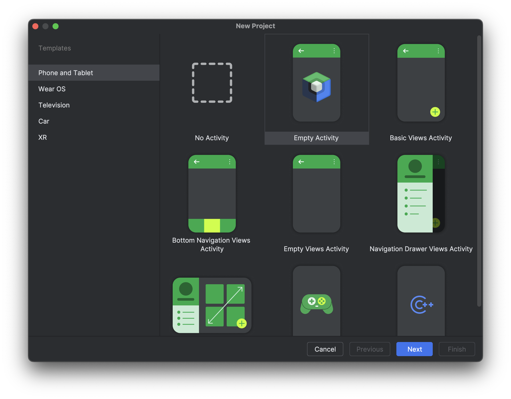
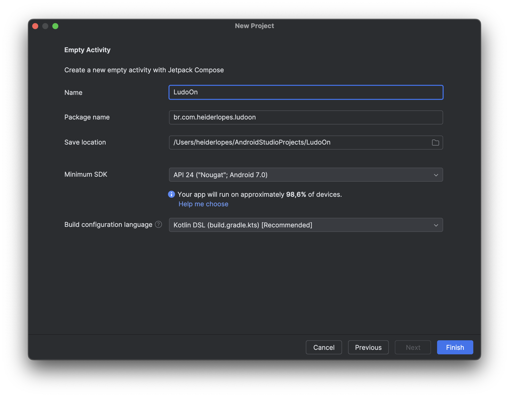
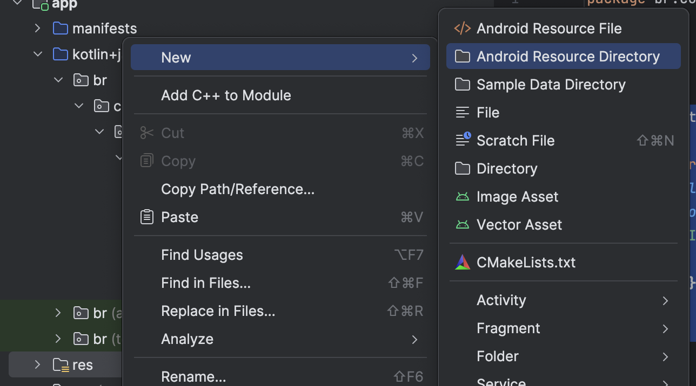
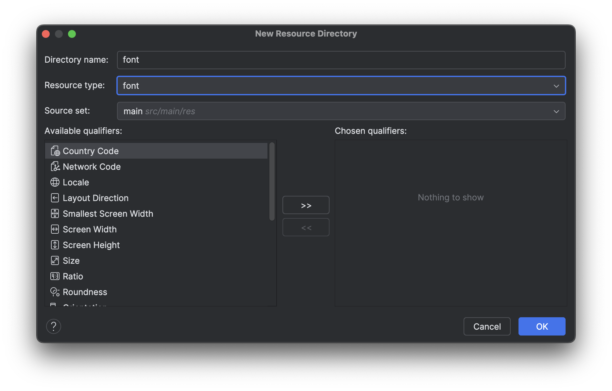
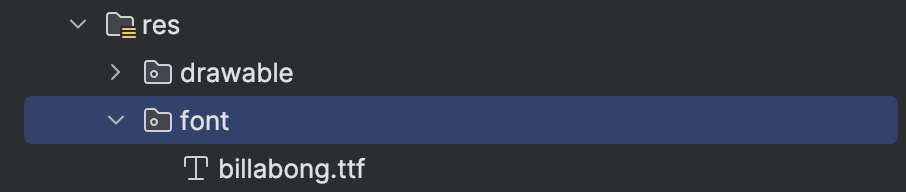
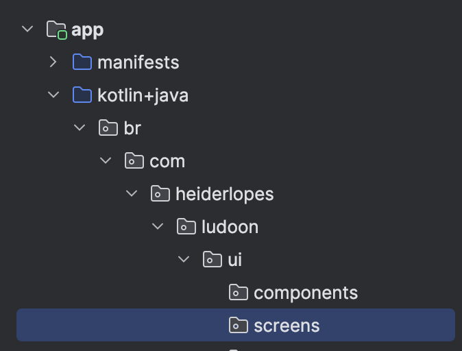

# LudoOn

Neste guia, você aprenderá passo a passo como criar um projeto Android moderno com **Kotlin** e **Jetpack Compose (Material 3)** no **Android Studio**.

---

## 1. Abrindo o Android Studio

Abra o **Android Studio** (versão recomendada: Giraffe ou superior).  
Na tela inicial, você verá a opção para criar um novo projeto.

---

## 2. Criando um novo projeto

Clique em **“New Project”**.

Em seguida, escolha o tipo de template. Para começar com **Compose**, selecione:

> 🧩 **Empty Activity (Compose)**

📸 _Seleção do template de projeto:_



---

## 3. Configurando o projeto

Preencha as informações básicas:

| Campo             | Descrição                                             |
| ----------------- | ----------------------------------------------------- |
| **Name**          | Nome do seu aplicativo (ex: _LudoOn_)                 |
| **Package name**  | Identificador único (ex: `br.com.heiderlopes.ludoon`) |
| **Save location** | Pasta onde o projeto será salvo                       |
| **Language**      | Selecione **Kotlin**                                  |
| **Minimum SDK**   | Escolha **API 24: Android 7.0 (Nougat)** ou superior  |

📸 _Tela de configuração do projeto:_



> 💡 _Dica:_ quanto menor o “Minimum SDK”, mais dispositivos o app suportará, mas com possíveis limitações de recursos modernos.

---

## 4. Configurando as cores bases

Abra o arquivo **Theme.kt** que encontra-se dentro de **ui/theme** e adicione as cores do background.

```Kotlin
private val DarkColorScheme = darkColorScheme(
    primary = Purple80,
    secondary = PurpleGrey80,
    tertiary = Pink80,
    background = Color.Black,
    onBackground = Color.White
)

private val LightColorScheme = lightColorScheme(
    primary = Purple40,
    secondary = PurpleGrey40,
    tertiary = Pink40,
    background = Color.White,
    onBackground = Color.Black
)

```

## 5. Configurando as dimensões padrões no app

Crie um arquivo chamado **Dimens.kt** dentro de **ui/theme**. Estas dimensões serão utilizadas no app ao longo do desenvolvimento.

```kotlin
import androidx.compose.ui.unit.dp
import androidx.compose.ui.unit.sp


val spacingSmall = 4.dp
val spacingMedium = 8.dp
val spacingLarge = 16.dp
val spacingXLarge = 24.dp

val fontSmall = 12.sp
val fontMedium = 16.sp
val fontLarge = 18.sp
val fontXLarge = 24.sp
val fontXXLarge = 32.sp

val iconTopBar = 28.dp
val iconBottomBar = 28.dp
```

## 6. Configurando as strings

Abra o arquivo **strings.xml** e adicione as strings que serão utilizadas no aplicativo. No decorrer do desenvolvimento esse arquivo pode acrescentar novos valores.

```kotlin
<resources>
    <string name="app_name">LudoOn</string>
    <string name="story_content_description" formatted="true">Story de %1$s</string>
</resources>
```

## 7 - Fonte Customizada

### 7.1 - Baixando a fonte

Baixe a fonte do logo do app:

[📥 Baixar o arquivo da fonte](./resources/billabong.ttf)

### 7.2 - Criando a pasta font

Crie uma pasta chamada **font** dentro de **res** (botão direito sobre **res -> New -> Android Resource Directory**)



Defina o nome como **font** :


### 7.3 - Adicione a fonte ao projeto

Cole a fonte baixada dentro da pasta criada.



## 8. Configurando a tipografia

Abra o arquivo **Type.kt** dentro de **ui/theme** e altere o seu conteéudo.

```kotlin
val Typography = Typography(
    bodyLarge = TextStyle(
        fontFamily = FontFamily.Default,
        fontWeight = FontWeight.Normal,
        fontSize = 16.sp,
        lineHeight = 24.sp,
        letterSpacing = 0.5.sp
    ),
    labelSmall = TextStyle(
        fontFamily = FontFamily.Default,
        fontWeight = FontWeight.Normal,
        fontSize = fontSmall,
        lineHeight = 24.sp,
        letterSpacing = 0.5.sp
    )
)
```

## 9. Adicionando a bibliotecas de ícones

Abra o arquivo **build.gradle**. do módulo **app.**

Dentro de **dependencies** adicione:

```kotlin
dependencies {
    // ✅ Manter as demais dependências.
    // Esta lib contém Ícones adicionais (outlined, rounded, sharp, etc)
    implementation("androidx.compose.material:material-icons-extended:1.7.8")

}
```

## 10. Organizando os Componentes

Dentro do package **ui** crie um novo package chamado **components**.

Dentro do package **ui** crie um novo package chamado **screens**.



## 11. Começando a HomeScreen

Dentro do package **screens** crie uma classe chamada **HomeScreen**.

Adicione o código dentro de **HomeScreen.kt**.

```Kotlin
@Composable
fun HomeScreen() {
    Scaffold(
        modifier = Modifier.background(MaterialTheme.colorScheme.background)
    ) { padding ->
        Box(
            modifier = Modifier
                .fillMaxSize()
                .padding(padding),
            contentAlignment = Alignment.Center
        ) {
            Text(text = "Feeds aqui")
        }
    }
}

@Preview(showBackground = true)
@Composable
fun HomeScreenPreview(modifier: Modifier = Modifier) {
    HomeScreen()
}
```

## 12. Iniciando o app com a HomeScrren.

Adicione o código dentro de **MainActivity.kt**.

```Kotlin
class MainActivity : ComponentActivity() {
    override fun onCreate(savedInstanceState: Bundle?) {
        super.onCreate(savedInstanceState)
        enableEdgeToEdge()
        setContent {
            LudoOnTheme {
                HomeScreen()
            }
        }
    }
}
```
